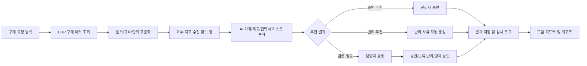

# AI 기반 구매 의사결정 지원 및 비교 분석 시스템 기획서

## 1. 프로젝트 개요

### 1.1 프로젝트명

SK에코플랜트 협력사 구매 최적화를 위한 AI 비교 분석 솔루션 구축

### 1.2 추진 목적

과거 구매 이력, 현재 발주 조건, 외부 공신력 지표를 통합 분석하여 발주 단가의 적정성을 검토하고, 구매 승인 프로세스의 반복 검토 업무를 자동화한다. 시스템은 최종 의사결정을 대체하기보다 구매 담당자와 관리자의 판단을 보조하는 의사결정 지원 도구로 정의한다.

### 1.3 주요 사용자

- SK에코플랜트 구매 담당자
- 현장 발주 관리자
- 구매 승인권자
- 협력사 평가 및 원가 관리 담당자

### 1.4 정량 목표

- 구매 단가 검토 및 승인 리드타임 30% 단축
- 반복 단가 비교 업무 50% 이상 자동화
- 고가 발주 및 중복 구매 탐지로 연간 구매 비용 5~10% 절감 가능성 검증
- 반려 사유와 승인 근거의 표준화로 구매 의사결정 투명성 강화

## 2. 구축 범위

### 2.1 MVP 범위

초기 구축 단계에서는 전체 구매 업무를 자동화하기보다, 구매 단가 검토와 승인 보조에 집중한다.

- 자재 구매 요청 목록 조회
- 품목별 과거 구매 이력 비교
- 외부 물가 지표 기반 적정 단가 산정
- AI 위험도 및 이상 단가 탐지
- 승인, 반려, 보류, 강제 승인 처리
- 반려 사유 자동 생성
- 관리자 검토 이력 저장

### 2.2 고도화 범위

- 유사 규격 품목 추천
- 협력사 납기 준수율 및 품질 점수 반영
- 재고 및 프로젝트 일정 연계
- 예외 승인 정책 관리
- 모델 성능 모니터링 및 피드백 학습
- ERP, 그룹웨어, 전자결재 시스템 연동

## 3. 시스템 아키텍처 및 기술 스택

### 3.1 프론트엔드

React 또는 Next.js 기반으로 구매 담당자가 빠르게 판단할 수 있는 대시보드를 구성한다.

주요 화면은 다음과 같다.

- 구매 요청 목록 및 상태 대시보드
- 품목별 가격 비교 상세 화면
- 외부 지표 대비 단가 변동 그래프
- AI 추천 사유 및 위험 요인 표시
- 승인, 반려, 보류, 강제 승인 처리 화면

보안 측면에서는 사용자 권한별 접근 제어, JWT 또는 사내 SSO 기반 인증, 승인권자별 기능 제한을 적용한다.

### 3.2 백엔드

Node.js 기반 API 서버를 중심으로 ERP 데이터와 외부 지표 데이터를 표준화한다.

주요 역할은 다음과 같다.

- ERP 구매 요청 및 구매 이력 데이터 수집
- 외부 공신력 기관 API 연동
- 품목 코드, 규격, 단위, 통화, 세금 조건 표준화
- AI 엔진 호출 및 결과 저장
- 승인/반려/예외 승인 이력 관리
- 감사 로그 및 권한 관리

### 3.3 AI 엔진

Python 기반 분석 모듈로 가격 이상치 탐지와 적정 단가 추정을 수행한다.

초기 모델은 설명 가능성과 운영 안정성을 우선한다.

- 규칙 기반 필터: 평균가, 최저가, 최고가, 표준편차, 임계값 비교
- 이상치 탐지: Isolation Forest, Local Outlier Factor 등
- 예측 모델: Random Forest, XGBoost, 시계열 회귀 모델
- 설명 가능성: 피처 중요도, 가격 상승 요인, 외부 지표 영향도 제공

초기에는 복잡한 딥러닝보다 규칙 기반 분석과 트리 기반 모델을 병행하여, 업무 담당자가 결과를 이해하고 검증할 수 있도록 한다.

### 3.4 수행 조직 및 역할

이루소의 수행 범위는 프론트엔드, 백엔드, AI 분석 엔진을 분리하되 소규모 팀에서 병렬로 진행 가능한 구조로 설계한다. 세부 인력 규모는 실제 투입 가능 인원에 맞춰 조정하되, 최소 역할은 다음과 같이 구성한다.

- PM/기획: 요구사항 정의, 고객 커뮤니케이션, 일정 및 범위 관리
- 프론트엔드 개발: 대시보드, 비교 분석 화면, 승인 처리 UI 구현
- 백엔드 개발: ERP 연동, API 서버, 권한, 감사 로그, 데이터 표준화 구현
- AI/데이터 엔지니어: 가격 분석 모델, 외부 지표 보정 로직, 모델 검증 구현
- QA/운영 담당: 테스트 시나리오, 사용자 검증, 운영 이슈 관리

초기 PoC에서는 PM, 프론트엔드, 백엔드, AI/데이터 역할을 최소 단위로 운영하고, MVP 단계에서 QA와 운영 안정화 역할을 보강한다.

## 4. 핵심 프로세스

### 4.0 시스템 흐름

### 4.1 데이터 입력 및 매칭

담당자가 자재 구매 요청을 등록하거나 ERP에서 구매 요청이 생성되면 시스템이 해당 품목의 과거 구매 이력을 조회한다.

매칭 기준은 다음과 같다.

- 품목 코드
- 자재명
- 규격
- 단위
- 구매 수량
- 공급사
- 현장 및 프로젝트
- 납기 조건

동일 품목 이력이 부족한 경우 유사 규격 품목을 후보로 제시하되, AI 판단 근거에는 유사 매칭임을 명확히 표시한다.

### 4.2 단계별 AI 필터링

1차 필터는 가격 적정성이다. 현재 발주 단가가 과거 평균가와 외부 물가 지수 보정 단가를 초과하는지 판단한다.

2차 필터는 재고 및 수요 적합성이다. 현재 재고, 현장 소요 시점, 프로젝트 일정과 비교하여 중복 구매 또는 과다 구매 가능성을 판단한다.

3차 필터는 공급사 리스크다. 협력사의 납기 준수율, 품질 이슈, 과거 클레임, 거래 안정성을 반영한다.

4차 필터는 예외 조건이다. 긴급 발주, 단종품, 특수 규격, 현장 안전 관련 자재 등은 일반 기준과 별도로 관리자가 판단할 수 있도록 한다.

### 4.3 의사결정 처리

AI 분석 결과는 다음 네 가지 상태로 분류한다.

- 승인 추천: 가격, 재고, 납기, 협력사 리스크가 기준 범위 내인 경우
- 검토 필요: 일부 기준을 초과하나 업무상 예외 가능성이 있는 경우
- 반려 추천: 가격 또는 재고 기준을 명확히 초과한 경우
- 강제 승인: 현장 긴급성 등 사유를 남기고 관리자가 승인한 경우

반려 또는 검토 필요 상태에서는 시스템이 자동으로 사유를 생성한다.

예시:

- 과거 평균가 대비 15.4% 높습니다.
- 외부 물가지수 보정 단가보다 8.2% 높습니다.
- 동일 자재 재고가 약 2개월분 남아 있습니다.
- 해당 협력사의 최근 6개월 납기 준수율이 기준보다 낮습니다.

## 5. 데이터 확보 및 표준화 전략

### 5.1 내부 데이터

- ERP 구매 요청 데이터
- 과거 발주 및 계약 단가
- 입고 및 검수 이력
- 재고 현황
- 프로젝트별 자재 소요 계획
- 협력사 평가 데이터

### 5.2 외부 데이터

- 한국은행 ECOS 물가지수
- 조달청 나라장터 표준 단가 및 입찰 정보
- 한국물가정보 자재별 시세
- LME 금속 가격
- 환율, 유가, 원자재 가격 지표

### 5.3 데이터 표준화

데이터 품질이 AI 판단의 정확도를 좌우하므로, 초기 구축 시 다음 항목을 우선 정비한다.

- 품목 코드 정합성
- 단위 변환
- 규격 표준화
- 통화 및 세금 조건 정규화
- 프로젝트별 특수 조건 분리
- 동일 품목과 유사 품목 구분

## 6. 리스크 관리

### 6.1 데이터 신뢰성 리스크

건설 및 플랜트 자재는 비정형 규격이 많고, 동일 품목이라도 현장 조건에 따라 단가 차이가 발생할 수 있다. 이력 데이터가 부족하거나 규격 매칭이 부정확하면 AI 판단 오류가 발생할 수 있다.

대응 방안:

- 유사 품목 매칭 신뢰도 표시
- 데이터 부족 품목은 자동 반려가 아닌 검토 필요로 분류
- 담당자가 품목 매칭을 수정할 수 있는 피드백 기능 제공
- 모델 판단과 규칙 판단을 분리 표기

### 6.2 법적 및 협력사 관계 리스크

AI의 반려 의견이 협력사에 대한 부당한 단가 인하 압박으로 해석되지 않도록 시스템의 법적 성격을 명확히 해야 한다.

대응 방안:

- AI 결과는 참고용 가이드로 표시
- 최종 승인 및 반려는 담당자와 승인권자가 수행
- 반려 사유는 객관적 데이터 기준으로 작성
- 예외 승인과 담당자 의견을 감사 로그로 보존
- 법무 및 구매 정책 검토 후 문구 확정

### 6.3 현장 긴급성 리스크

AI 필터가 지나치게 엄격하면 긴급 자재 수급이 지연되어 공정 지연으로 이어질 수 있다.

대응 방안:

- 긴급 발주 플래그 제공
- 강제 승인 기능 제공
- 강제 승인 사유 입력 필수화
- 사후 검토 리포트 자동 생성

### 6.4 모델 신뢰성 리스크

모델 성능이 충분히 검증되지 않은 상태에서 자동 반려를 수행하면 업무 저항과 판단 오류가 발생할 수 있다.

대응 방안:

- 초기에는 의사결정 지원 모드로 운영
- 승인/반려 추천 정확도 측정
- 구매 담당자 피드백 기반 모델 개선
- 월별 모델 성능 리포트 제공

## 7. 기대효과

### 7.1 비용 절감

과거 단가와 외부 지표를 함께 반영하여 부적절한 고가 매입을 조기에 탐지한다. 특히 반복 구매 품목과 원자재 가격 변동성이 큰 품목에서 비용 절감 효과가 클 것으로 예상된다.

### 7.2 업무 효율 향상

구매 담당자가 수작업으로 수행하던 가격 비교, 이력 조회, 반려 사유 작성 업무를 자동화하여 승인 처리 시간을 단축한다.

### 7.3 의사결정 투명성 확보

AI 분석 결과, 외부 지표, 내부 구매 이력을 함께 제시하여 단가 판단 근거를 표준화한다. 이를 통해 협력사 커뮤니케이션과 내부 감사 대응력을 높일 수 있다.

### 7.4 데이터 기반 구매 체계 구축

구매 담당자의 경험에 의존하던 판단을 데이터 기반 기준으로 전환한다. 장기적으로는 협력사 평가, 프로젝트 원가 관리, 예산 계획에도 활용할 수 있다.

## 8. 단계별 추진 계획

### 8.1 1단계: PoC

기간은 약 4~6주를 기준으로 한다.

- 대표 자재군 3~5개 선정
- 과거 구매 이력 데이터 정제
- 외부 지표 1~2종 연동
- 가격 이상치 탐지 모델 구현
- 단가 비교 대시보드 시제품 제작
- 담당자 검증 및 개선점 도출

### 8.2 2단계: MVP

기간은 약 8~12주를 기준으로 한다.

- ERP 데이터 연동
- 구매 요청 목록 및 상세 분석 화면 구축
- 승인, 반려, 보류, 강제 승인 프로세스 구현
- 반려 사유 자동 생성
- 권한 관리 및 감사 로그 구현
- 주요 자재군으로 적용 범위 확대

### 8.3 3단계: 운영 고도화

기간은 약 3~6개월을 기준으로 한다.

- 협력사 리스크 모델 반영
- 재고 및 프로젝트 일정 연동
- 유사 규격 추천 모델 고도화
- 모델 성능 모니터링
- 전사 구매 정책 및 전자결재 연동

## 9. 화면 구성 초안

### 9.1 구매 검토 대시보드

- 전체 요청 건수
- 승인 추천 건수
- 검토 필요 건수
- 반려 추천 건수
- 예상 절감 가능 금액
- 위험도 상위 품목 목록

### 9.2 품목 상세 분석 화면

- 현재 발주 단가
- 과거 최저가, 평균가, 최고가
- 외부 지표 보정 단가
- AI 추천 상태
- 가격 차이 요인
- 재고 및 납기 정보
- 협력사 신뢰도
- 승인/반려/보류/강제 승인 버튼

### 9.3 관리자 리포트

- 월별 절감 추정액
- 반려 사유 유형별 통계
- 강제 승인 건수 및 사유
- 품목별 가격 변동 추이
- 협력사별 리스크 현황

## 10. 성공 조건

본 시스템의 성공 여부는 단순히 AI 모델 정확도만으로 판단하지 않는다. 구매 담당자가 실제 업무에서 신뢰하고 사용할 수 있는지, 반려 사유가 객관적으로 설명 가능한지, 현장 예외를 무리 없이 처리할 수 있는지가 핵심이다.

따라서 초기 구축의 핵심 원칙은 다음과 같다.

- 자동 결정이 아닌 의사결정 지원
- 설명 가능한 AI
- 데이터 부족 상황에 대한 보수적 판단
- 관리자 예외 승인 허용
- 법무 및 구매 정책과 정합성 확보
